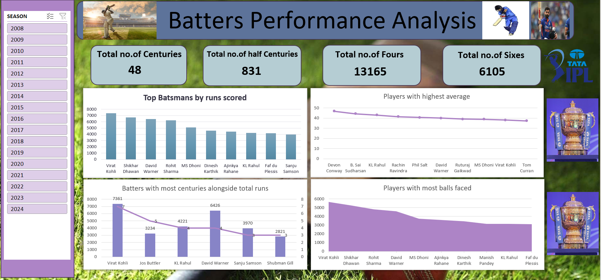
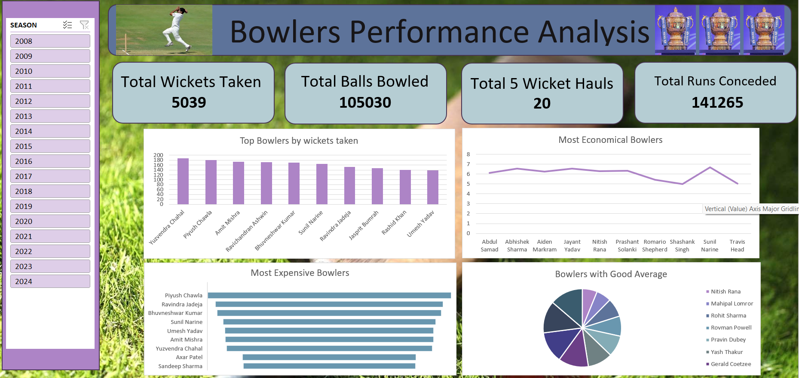

# ipl-performance-analysis-dashboard
Data-driven Excel dashboard analyzing 1100+ IPL player records with overall performance metrics and dedicated deep-dive analytical sections for batters and bowlers.

# IPL Performance Analysis Dashboard (Excel Project)

## 📊 Project Overview
This project presents an in-depth performance analysis of IPL players using Microsoft Excel. The dataset contains 1100+ player-season records covering batting, bowling, and fielding statistics across multiple IPL seasons.

The goal of this project was to transform raw cricket statistics into meaningful insights using Pivot Tables, Charts, and Interactive Dashboard techniques.

---

## 📂 Dataset Details
- 1130+ rows of player-season data
- 24 performance metrics
- Includes:
  - Batting Statistics (Runs, Average, Strike Rate, 100s, 50s, Fours, Sixes)
  - Bowling Statistics (Wickets, Economy Rate, Bowling Average, Strike Rate)
  - Fielding Statistics (Catches, Stumpings)
  - Season-wise performance tracking

---

## 📈 Dashboard Features

### 1️⃣ Overall Performance Analysis
- Top Run Scorers
- Highest Wicket Takers
- Most Catches
- Most Centuries & Half Centuries
- Best Economy Rate Bowlers

### 2️⃣ Batters Performance Analysis
- Highest Batting Average
- Best Strike Rate
- Most Centuries
- Boundary Analysis (Fours & Sixes)
- Season-wise comparison

### 3️⃣ Bowlers Performance Analysis
- Most Wickets
- Best Bowling Average
- Best Economy Rate
- Strike Rate Analysis
- 4W & 5W Hauls comparison

---

## 🛠 Tools & Techniques Used
- Microsoft Excel
- Pivot Tables
- Pivot Charts
- Slicers for Interactive Filtering
- Data Aggregation & KPI Analysis

---

## 🎯 Key Insights
- Identified consistent top-performing batsmen across seasons
- Compared bowlers based on efficiency and wicket-taking ability
- Highlighted all-round contributions including fielding performance
- Built an interactive analytical dashboard for performance exploration

---

## 📌 Author
Ritesh Nalawade  
Aspiring Data Analyst
